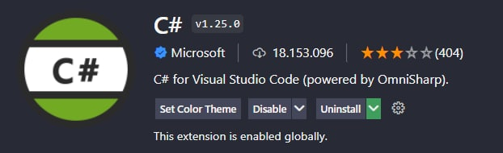
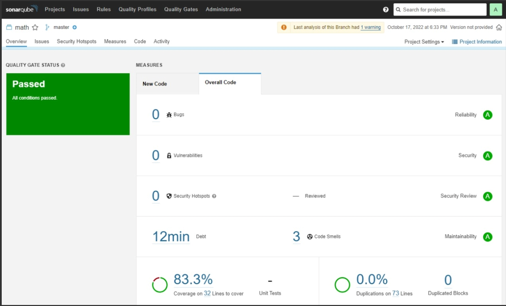

# 📚 Seminário C214 - xUnit

Criação de testes unitários de uma aplicação utilizando o xUnit. Para esse projeto, a aplicação feita foi uma calculadora.

## ❗ Instalação

São utilizadas as seguintes ferramentas:
- [Visual Studio Code](https://code.visualstudio.com/download)
- [.NET Core](https://learn.microsoft.com/pt-br/dotnet/core/install/windows?tabs=net60)
- [Docker](https://docs.docker.com/desktop/install/windows-install/)

## ⚙ Preparando o ambiente

É necessário executar o comando abaixo no terminal para obter a skd .NET:

    winget install Microsoft.DotNet.SDK.6

No Visual Studio Code são utilizadas as extensões a seguir:
- .Net Core Test Explorer

- C# for Visual Studio Code (Omnishap)

## 🏢 Estrutura projeto C#

A estrutura do projeto consiste nas pastas src e test e é feita utilizando os seguintes comandos no terminal:

Para criar o diretório src

    mkdir src

Para criar o diretório testes

    mkdir test

## 💡 Criar solution file

Inserir o comando abaixo no terminal para a criação do arquivo:

    dotnet new sln –name SolucaoCalc

Verificar a versão do sdk:

    dotnet –list-sdks

Após isso, criar um arquivo "global.json" no Visual Studio Code e preenchê-lo da seguinte forma:

    {
        "projects":["src","test"],
        "sdk":
        {
            "version":"VERSAO_SDK"
        }
    }

## 🏁 Criando o projeto

Mudar para a pasta src e criar o projeto que será testado:

    dotnet new console -o Calc

Mudar para a pasta test e criar o projeto xUnit:

    dotnet new xunit -o Calc.Test

Após isso, voltar para a raiz do diretório principal e executar os seguintes comandos para ajustar as referências dos projetos para que eles consigam se identificar:

    dotnet sln */*/*.csproj

    dotnet add ./test/Calc.Tests/Calc.Tests.csproj reference ./src/Calc/Calc.csproj

## 👨‍👦 Instalando as dependências

### Projeto de testes:
Executar os comandos abaixo a partir da pasta raiz

    cd test\Calc.Tests
    dotnet add package Moq --version 4.16.1
    dotnet add package Microsoft.NET.Test.Sdk --version 17.1.0
    dotnet add package xunit --version 2.4.1
    dotnet add package xunit.runner.visualstudio --version 2.4.3
    dotnet add package coverlet.msbuild --version 3.1.2
    dotnet add package FluentAssertions --version 6.7.0

### Projeto que será testado:
Executar os comandos abaixo a partir da pasta raiz

    cd src\Calc
    dotnet add package coverlet.msbuild --version 3.1.2

### Executando o projeto
#### A partir da pasta raiz:
    cd src\Calc
    dotnet add package coverlet.msbuild --version 3.1.2

### Executando os testes dentro do projeto:
Para executar os testes, é necessário navegar até os arquivos UnitTest1.cs e UnitTest2.cs, para cada teste haverá uma opção Run Test que pode ser clicada para executar o teste individualmente, ou então à nível de classe é possível clicar em Run All Tests para executar todos em sequência.

Através da extensão do VSCode com o nome "Testing", clicar no ícone de refresh e
uma lista com os testes das duas classes estarão disponíveis, neste caso também é
possível executar os testes um à um ou todos em sequência.

### Gerando o relatório de cobertura

#### Instalar console coverlet:
    dotnet tool install -g coverlet.console
#### Fazer o build do projeto:
    dotnet build

### Integrando com Sonarqube:

#### Subindo uma instância do Sonarqube no docker:
    docker run -d --name sonarqube -p 9000:9000 -p 9092:9092 sonarqube
#### Instalar SonarScanner tool para análise dos testes:
    dotnet tool install --global dotnet-sonarscanner

### Verificar se o container do Sonarqube está rodando no docker e inserir o seguinte comando para gerar o relatório:
    dotnet test test\Calc.Tests\Calc.Tests.csproj -p:CollectCoverage=true
    -p:CoverletOutputFormat=opencover
    dotnet build-server shutdown

### No navegador (localhost:9000):
    - Fazer o primeiro acesso com os dados: login: admin e senha: admin
    - Alterar a senha para outra qualquer
    - Clicar na opção "Manually"
    - Inserir o nome "calculadora" no campo "Project display name" e clicar no botão "Setup"
    - Clicar na opção "Locally"
    - Clicar na opção "Generate"
    - Copiar o TOKEN gerado e guardar para a tela seguinte, clicar em "continue"
    - Escolher a opção .NET > .NET Core

### De volta ao VSCode inserir o seguinte comando: (substituindo o token gerado na página do Sonarqube)
    dotnet sonarscanner begin -k:"calculadora" -d:sonar.host.url="http://localhost:9000" -d:sonar.cs.opencover.reportsPaths="test/Calc.Tests/coverage.opencover.xml" -d:sonar.login="TOKEN_COPIADO"

    dotnet build

    dotnet sonarscanner end -d:sonar.login="TOKEN_COPIADO"
